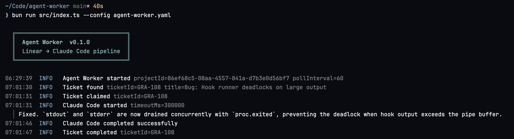

# agent-worker

A CLI tool that polls Linear for ready tickets and dispatches them to Claude Code for autonomous implementation.



## Prerequisites

- [Bun](https://bun.sh) 1.0+
- [Claude Code CLI](https://docs.anthropic.com/en/docs/claude-code) installed and authenticated
- A Linear account with a personal API key

## Installation

Download a pre-built binary from the releases page, or build from source:

```bash
git clone https://github.com/owainlewis/agent-worker
cd agent-worker
bun install
bun run build
```

The compiled binary is written to `dist/agent-worker`.

## Configuration

Copy the example config and edit it:

```bash
cp agent-worker.example.yaml agent-worker.yaml
```

Set your Linear API key as an environment variable:

```bash
export LINEAR_API_KEY=lin_api_...
```

### Configuration reference

```yaml
linear:
  project_id: "your-project-uuid"     # Linear project UUID (required)
  poll_interval_seconds: 60           # How often to check for new tickets

  statuses:
    ready: "Todo"                     # Status that marks a ticket ready for pickup
    in_progress: "In Progress"        # Status set when the agent claims a ticket
    done: "Done"                      # Status set on success
    failed: "Canceled"                # Status set on failure

repo:
  path: "/path/to/your/repo"          # Absolute path to the working repository

hooks:
  pre:                                # Commands to run before Claude Code (optional)
    - "git checkout main"
    - "git pull origin main"
    - "git checkout -b agent/task-{id}"

  post:                               # Commands to run after Claude Code succeeds (optional)
    - "bun run test"
    - "git add -A"
    - "git commit -m 'feat: {title}'"
    - "git push origin agent/task-{id}"

claude:
  timeout_seconds: 300                # Max time for Claude Code to complete
  retries: 0                          # Retry attempts on failure (0–3)

log:
  file: "./agent-worker.log"          # Log file path (omit for stdout only)
```

Hook commands support variable interpolation:

| Variable | Value |
|---|---|
| `{id}` | Linear ticket identifier (e.g. `ENG-42`) |
| `{title}` | Slugified ticket title (e.g. `add-login-page`) |
| `{branch}` | Generated branch name (`agent/task-{id}`) |

## Usage

```bash
agent-worker --config ./agent-worker.yaml
```

The worker runs as a foreground process and handles SIGINT/SIGTERM for graceful shutdown.

## How it works

1. **Poll** — Query Linear for tickets in the `ready` status on the configured interval.
2. **Claim** — Transition the ticket to `in_progress` to prevent duplicate processing.
3. **Pre-hooks** — Run pre-hook commands sequentially in the repository directory. If any command fails, the pipeline aborts.
4. **Claude Code** — Invoke Claude Code with the ticket title and description as the prompt. If it times out or exits non-zero, the pipeline fails.
5. **Post-hooks** — Run post-hook commands sequentially. If any command fails, the pipeline fails.
6. **Update status** — On success, transition the ticket to `done`. On failure, transition to `failed` and post a comment with the stage, command, and output.

One ticket is processed at a time. After a ticket completes (or fails), the worker returns to polling.

## Development

```bash
bun install       # Install dependencies
bun test          # Run tests
bun run build     # Compile binary to dist/agent-worker
```

Cross-platform builds:

```bash
bun run build:darwin-arm64
bun run build:darwin-x64
bun run build:linux-x64
```

## License

MIT
